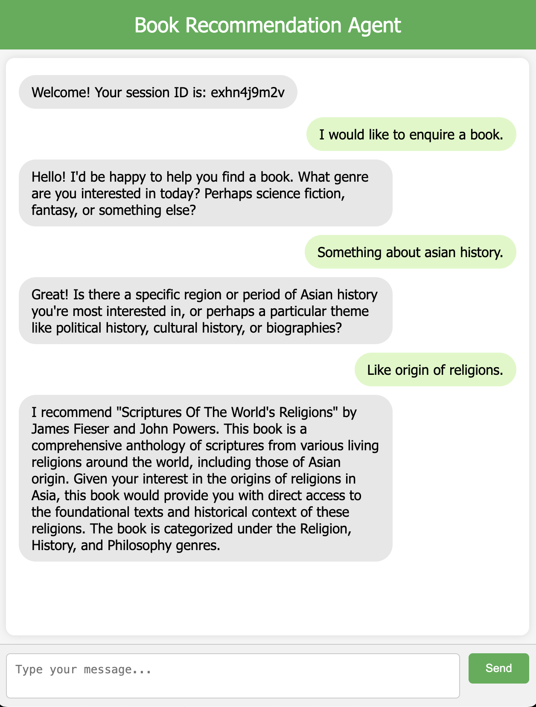

# A Multi-Agent Book Recommendation Application

A `ChatAgent` and a `RAGAgent` are orchestrated by an application service
`RecommendationService`.

### HTML Chat Window
Use the html frontend to have a conversation with the agents.
```shell
# Linux/MacOS
open ./src/main/resources/static/chat.html
```
```shell
# Windows
start ./src/main/resources/static/chat.html
```


### REST Requests
```shell
# Linux/MacOS
curl -G "http://localhost:8080/chat-recommend" \
--data-urlencode "sessionId=1" \
--data-urlencode "userMessage=I would like to get a science fiction for my 10 year-old boy."
```

```shell
# Windows
curl -G "http://localhost:8080/chat-recommend" ^
--data-urlencode "sessionId=1" ^
--data-urlencode "userMessage=I would like to get a science fiction for my 10 year-old boy."
```

The user's input message is the content following `userMessage=`.
The agent will remember the recent dialogues per session defined by `sessionId`.
